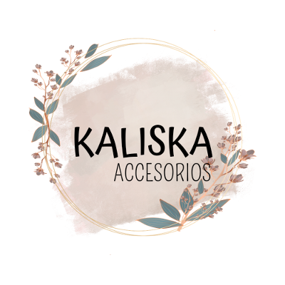

# Kaliska - accesorios

## Proyecto Web para la Diplomatura Full Stack UTN 2024

**Este archivo muestra el proyecto web desarrollado para la cursada de la Diplomatura Full Stack en la UTN, año 2024.**

**Este proyecto consiste en una tienda en línea de accesorios para mujer. Incluye las siguientes características:**

**Header con Barra de Navegación: Permite la navegación fácil y rápida por todo el sitio.**

**Banner Introductorio: Presenta una breve descripción de la página y su propósito.**

**Secciones de Categorías y Productos: Organizadas para mostrar una variedad de accesorios disponibles.**

**Formas de Contacto: Al final del sitio, se encuentran varias opciones de contacto para mejorar la interacción con los usuarios.**

**Este proyecto busca proporcionar una experiencia de compra cómoda y atractiva para los usuarios interesados en accesorios para mujer.**

[Enlace a una página web](https://www.ejemplo.com)

